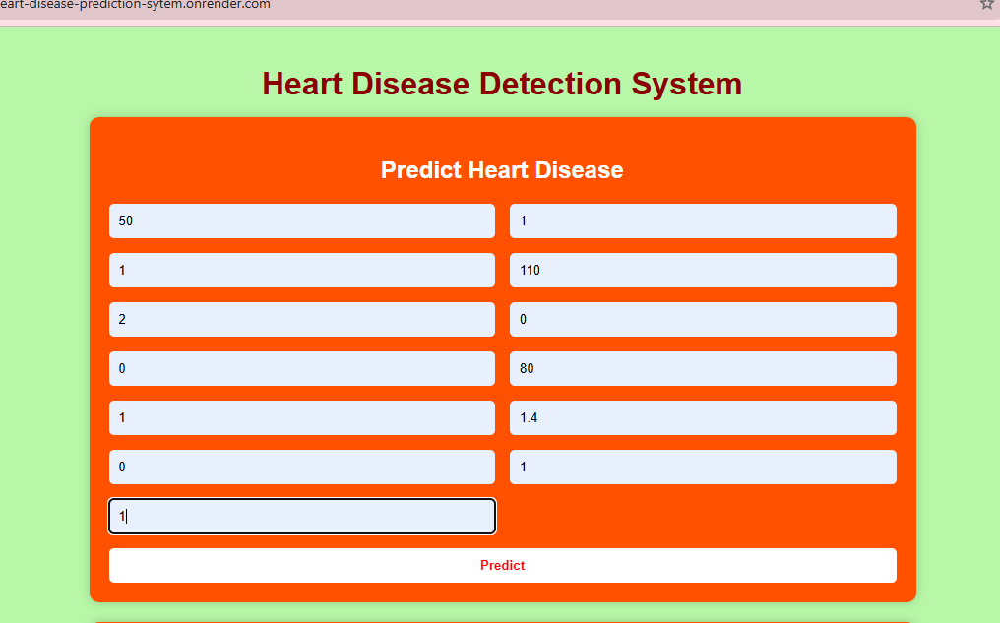
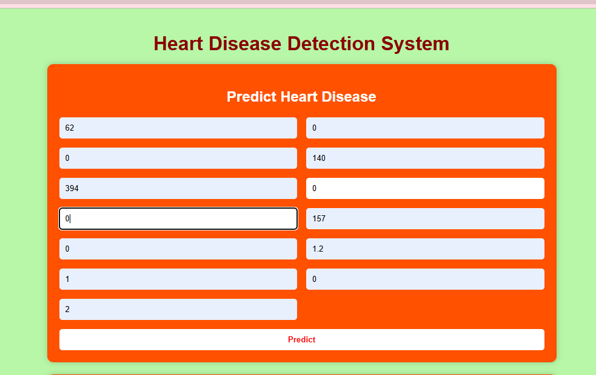
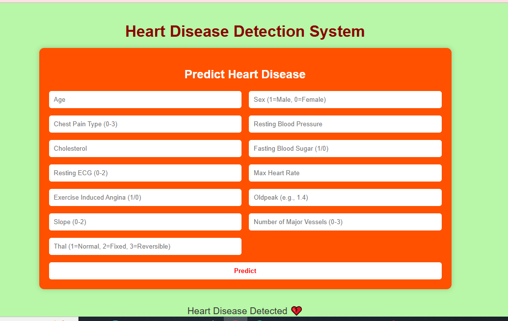

# Heart Disease Prediction Web Application

## Overview
A machine learning–powered web application that predicts the likelihood of heart disease based on patient health metrics. 
Built with Python and Flask, the system loads a trained ML model and provides real-time predictions via a simple web interface.

## Features
- Predicts heart disease risk using a trained ML model
- Simple, interactive web interface
- Cloud deployment ready (Render)
- Can run fully offline on a local system
- Easily extendable to other ML use cases

## Tech Stack
- **Python**  
- **Flask** (web framework)  
- **Scikit-learn** (ML model)  
- **Pandas, NumPy** (data processing)  
- **HTML/CSS** (frontend UI) 

## How It Works
1. User inputs health parameters (age, cholesterol, BP, etc.)
2. Flask backend processes the input
3. Pre-trained ML model (`hd_model.pkl`) generates prediction
4. Result is displayed instantly on the web interface


## Run Locally

### Prerequisites
- Python 3.9 or higher
- pip (Python package manager)

### Steps
1. Clone the repository:
```bash
git clone https://github.com/pecupreship/heart-disease-ml-web-app
cd heart-disease-ml-web-app

2. Create and activate virtual environment
python -m venv venv (to createvenv)
# Mac/Linux activation
source venv/bin/activate
# Windows activation
venv\Scripts\activate

3. Install dependencies
pip install -r requirements.txt

4. Run the application
python app.py

5. open you browser and visit
http://127.0.0.1:5000


## Screenshots

Here are examples of the application in action. All screenshots are from the fully functional web app.

### Input Form
Users can enter patient health metrics such as age, blood pressure, cholesterol, and more to get a prediction.


### Page that contain data for no heart disease result page



### Page that predict no heart disease 


### Page that contain data for heart disease result page



### Page that predict heart disease 




> 💡 Note: All screenshots are taken from the deployed version and the local version; both work identically.


